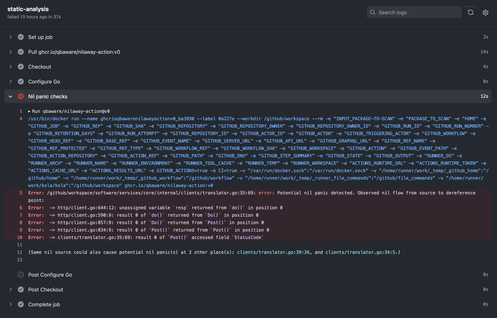

# Nilaway GitHub Action

[](https://github.com/super-linter/super-linter)


This is a simple GitHub Action that checks Golang codebases for potential Nil panics.

Behind the hood, it uses Uber's `nilaway` static analysis tool.
More useful information about it can be found in [this](https://www.uber.com/en-GB/blog/nilaway-practical-nil-panic-detection-for-go/)
Uber blog post or on their GitHub [repository](https://github.com/uber-go/nilaway).

## How To Use

### Figure Out The Inputs

As of now, the only input is the `package-to-scan` variable.
This is the path to the Golang package you want to analyze.
E.g. `./services/backend/...`.

### Modify Your Action

Add the following `static-analysis` job in your Action.

``` yaml
static-analysis:
  # Assuming the `build` job builds the project,
  # we define a dependency on it.
  needs: build

  runs-on: ubuntu-latest
  steps:
    - name: Checkout
      uses: actions/checkout@v3

    - name: Nil panic checks
      uses: qbaware/nilaway-action@v0
      with:
        package-to-scan: ./path/to/package/...
```

### That's It 🎉

### Sample Workflow


